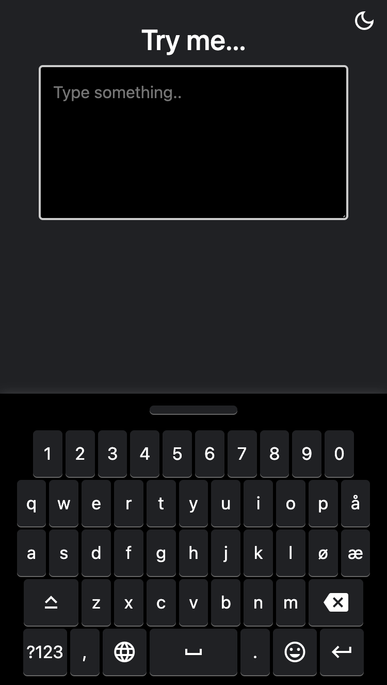
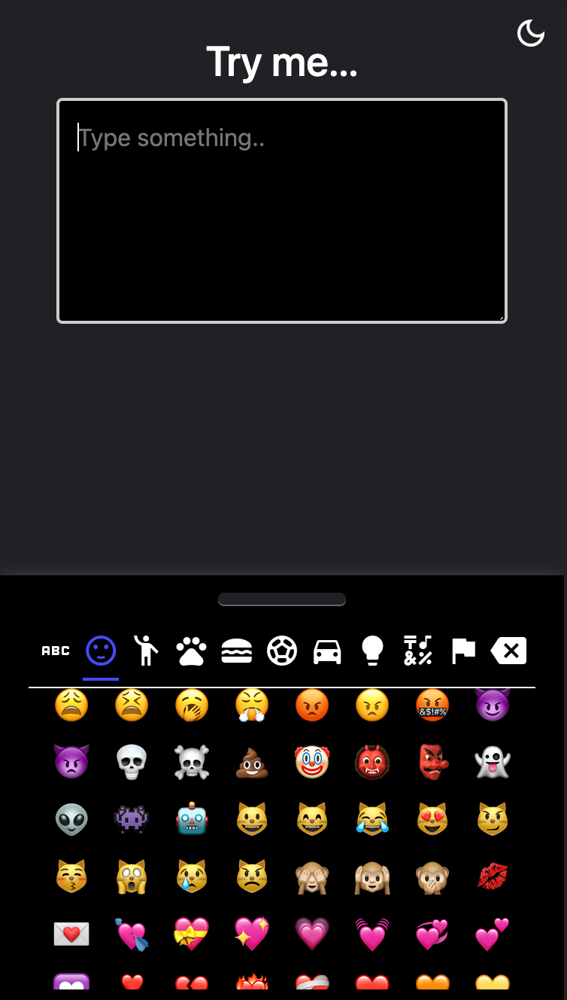
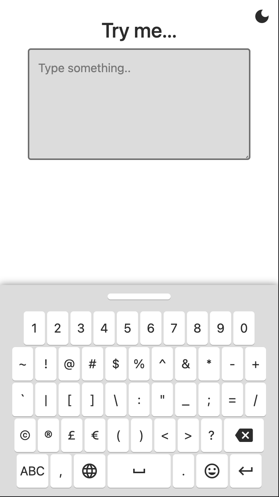
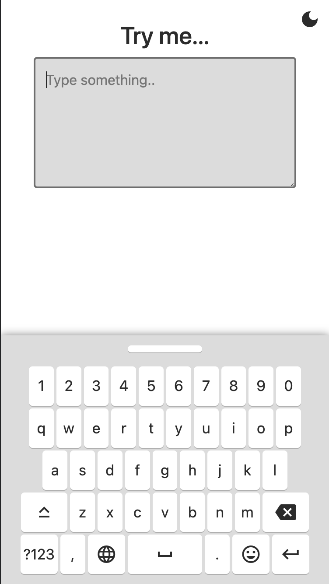
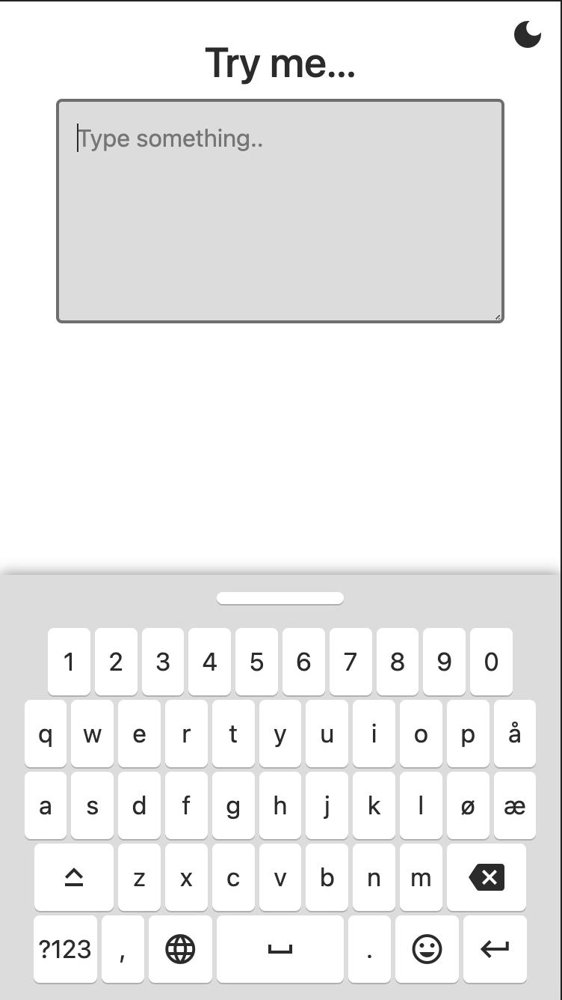
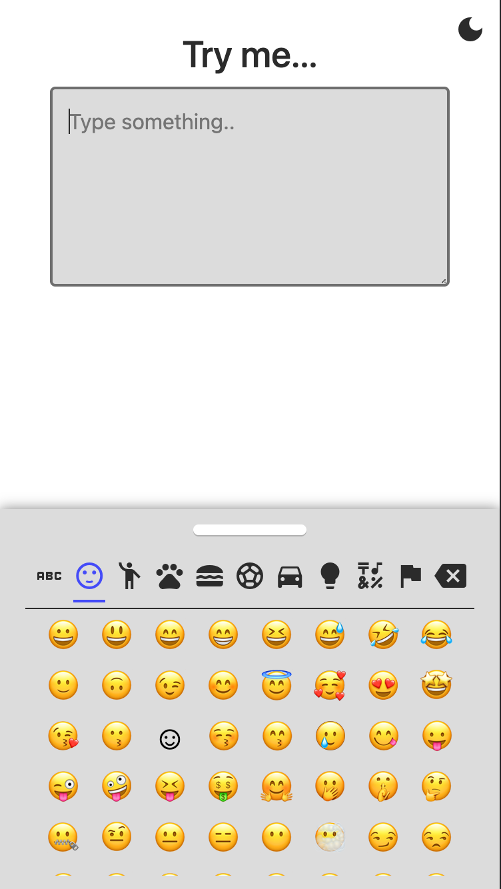
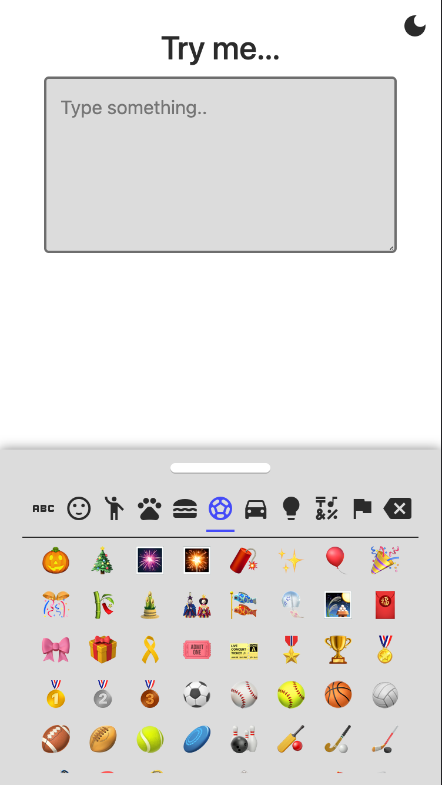
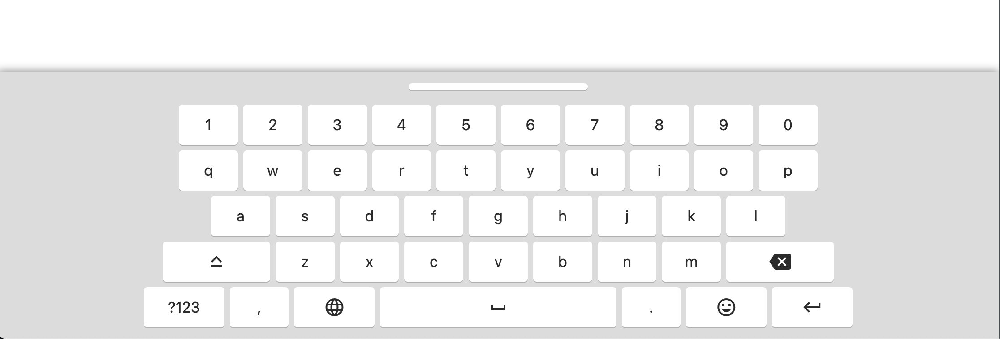
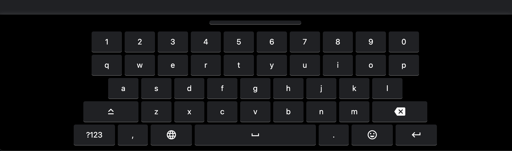

# vitual-keyboard :keyboard: :computer: :iphone:

## :information_source: Overview

This is a virtual keyborad, mobile responsive and easily can be integratable in your project. 

`Supported languages`:

* English :uk:
* Norwegian :norway:
* Basic symbols :symbols:
* Emoji :smiley:

## Installation :gear: :hammer_and_wrench:

In order to install it to your project add `emoji.js` :smiley: and `keyboard.js` :keyboard: to your scripts :scroll:, `keyboard.css` :keyboard: to your links :link: and add `class="virtual_keyboard"` in the inputs you like to use it for.

`mode.js` executes the dark mode

## :framed_picture: Collection

        

## Licences :balance_scale:

### Gemoji

The `emoji.js` file provides a full list of categories and tags emojis. It can be found as `emoji.json` at [gemoji's](https://github.com/github/gemoji) repository, licensed under the MIT License: <http://opensource.org/licenses/MIT>

### dcode

Project was based on video tutorial in youtube [:movie_camera: watch here](https://www.youtube.com/watch?v=N3cq0BHDMOY) or check codepen [here](https://codepen.io/dcode-software/pen/KYYKxP).
